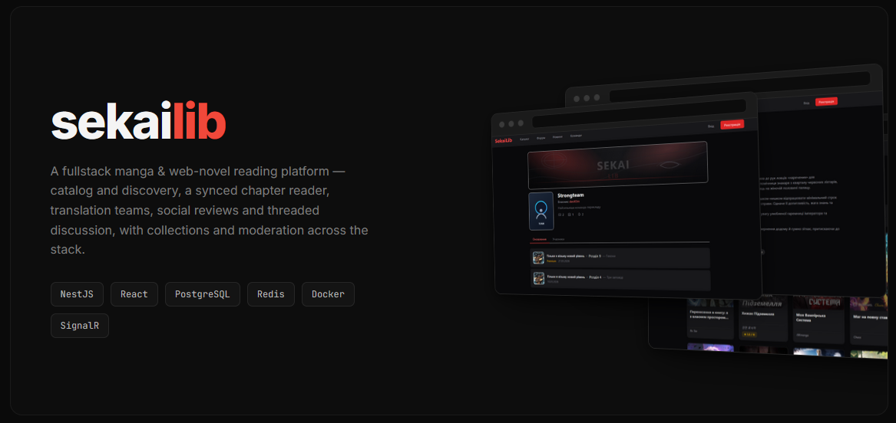
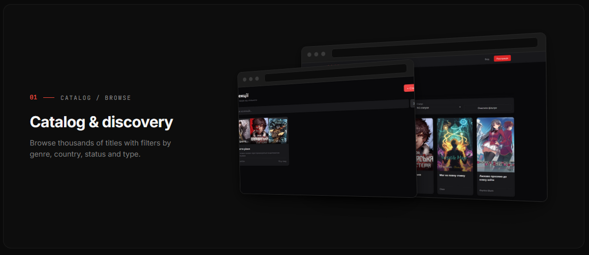
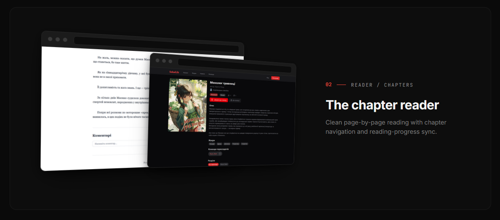
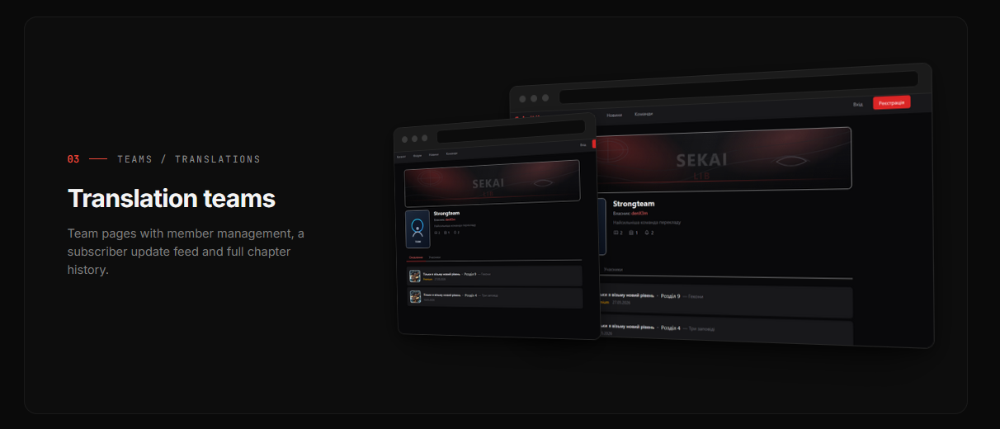
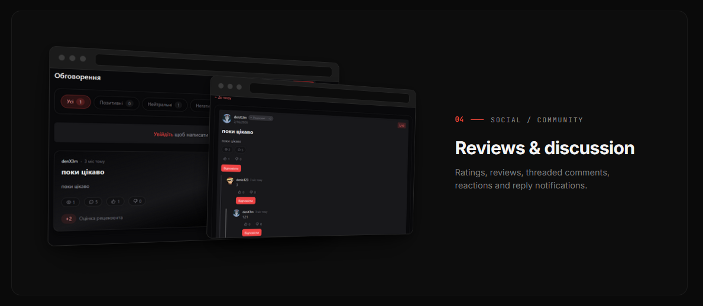
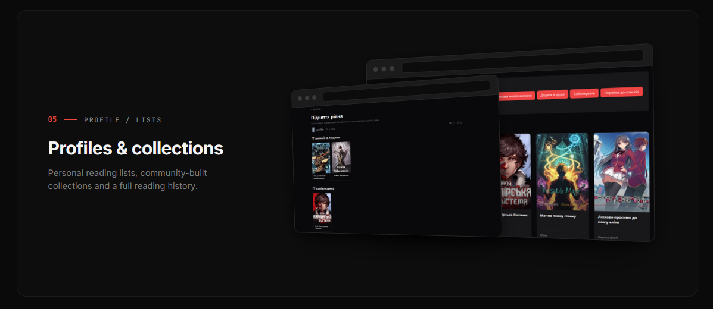

# sekailib

A fullstack manga & web-novel reading platform — catalog and discovery, a synced chapter reader, translation teams, social reviews and threaded discussion, with collections and moderation across the stack.

**Stack:** NestJS · React · TypeScript · PostgreSQL · Redis · SignalR · Docker

---













---

## Running locally

```bash
docker compose up --build
```

Client: `http://localhost:3000` · API: `http://localhost:8080`
